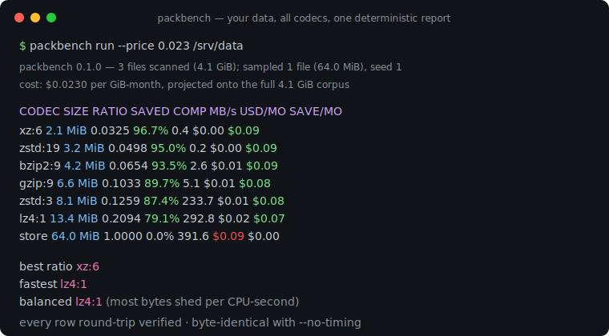
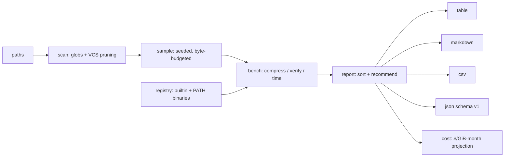

# packbench

[English](README.md) | [中文](README.zh.md) | [日本語](README.ja.md)

[](LICENSE) [](go.mod) [](CHANGELOG.md)  [](CONTRIBUTING.md)

**packbench：あなたの実データ上ですべてのコーデックとレベルを測定するオープンソース・依存ゼロの圧縮ベンチマーク——圧縮率・速度・ストレージコスト試算を 1 つの決定的レポートに。「zstd -3」という言い伝えに頼るのはもう終わり。**



```bash
git clone https://github.com/JaydenCJ/packbench && cd packbench
go build -o packbench ./cmd/packbench    # single static binary, stdlib only
```

> プレリリース：v0.1.0 はまだどのパッケージレジストリにもタグ付けされていません。上記の手順でソースからビルドしてください（Go ≥1.22 なら可）。

## なぜ packbench？

ほとんどのチームは言い伝えで圧縮設定を選んでいます——「zstd -3 がスイートスポット」「gzip -9 は割に合わない」——その言い伝えは、そもそも測定されたことがあるとしても、Silesia コーパスや別の時代の Calgary tarball の上で測られたものです。しかし圧縮率は*あなたの*データの性質です：JSON イベントストリーム、サービスログ、Parquet ファイル、圧縮済みメディアの挙動はまるで違い、ベンチマークコーパスで勝ったコーデックがあなたのバケットでは日常的に負けます。既存ツールはこの溝を埋めません：lzbench と TurboBench はコーデックの*ライブラリビルド*同士を比較し、ファイルは 1 つずつ手で与える必要があり、squash-benchmark は自前の Web コーパスの数値を報告するだけです。packbench はあなたのディレクトリツリーを直接指し、シード付き・バイト予算付きサンプリングで数 TiB のツリーも数秒で終わらせ、マシンに実在するすべてのコーデック——Go 組み込みの DEFLATE 系に加え、実際にデプロイする zstd/xz/bzip2/lz4/brotli のバイナリを公平な計時のため 1 スレッドに固定して——実行し、全結果をラウンドトリップ検証したうえで、財務チームが本当に気にする数字を載せた 1 つのレポートを出します：あなたのストレージ単価での月額ドル、サンプルからコーパス全体への外挿値です。

| | packbench | lzbench | zstd -b | squash-benchmark |
|---|---|---|---|---|
| ディレクトリツリーを直接測定（フィルタ、シード付きサンプリング） | ✅ | ⚠️ ファイルを 1 つずつ | ⚠️ ファイルを 1 つずつ | ❌ 固定 Web コーパス |
| ストレージコスト試算（$/GiB・月、月次/年次） | ✅ | ❌ | ❌ | ❌ |
| 実際にデプロイするバイナリを測定（PATH 自動検出） | ✅ | ❌ 同梱ライブラリビルド | ⚠️ zstd のみ | ❌ 同梱ライブラリビルド |
| 全結果のラウンドトリップ検証 | ✅ デフォルト | ⚠️ オプトイン | ✅ | ❌ |
| 決定的でコミット可能なレポート（JSON/CSV/MD） | ✅ `--no-timing` | ❌ テキストのみ | ❌ テキストのみ | ⚠️ ブラウザ UI のみ |
| 推薦エンジン（最良圧縮率 / 最速 / バランス） | ✅ | ❌ | ❌ | ❌ |
| ランタイム依存 | 0（単一静的バイナリ） | C ビルド、コーデックソース同梱 | libzstd | ブラウザ + ホスト済みデータ |

<sub>2026-07-13 確認：packbench は Go 標準ライブラリのみを import します。外部コーデックは実行時に PATH 上で発見される任意のバイナリで、リンクも同梱もしません。</sub>

## 特徴

- **合成コーパスではなく、あなたのデータ** — 任意のファイルとディレクトリの組み合わせを指定可能。include/exclude グロブ、最小サイズ下限、VCS ディレクトリの自動除外で `.git` の packfile が数値を汚しません。
- **バイト予算付きのシード付きサンプリング** — `--max-bytes 64MiB`（デフォルト）で数 TiB のツリーから公平なランダムサンプルを数秒でベンチマーク。同じ `--seed` は永遠に同じサンプルを引き、レポートは何をサンプルしたかを正確に述べます。
- **実際に持っているすべてのコーデック** — store/gzip/zlib/flate/lzw は組み込み、zstd/xz/bzip2/lz4/brotli は PATH 上にあれば各々の歴戦のバイナリ経由で駆動、MB/s が 1 コア対 1 コアになるよう全て 1 スレッドに固定。レベルは精密に指定できます（`--codecs gzip:1-9,zstd:3,zstd:19`）。
- **CFO が読めるコスト試算** — `--price 0.023`（S3 標準）で圧縮率を月額ドルと節約額に換算し、サンプルからスキャン済みコーパス全体へ、誠実な GiB・月単位で外挿します。
- **信頼せよ、だが検証せよ** — 全結果をデフォルトで展開してバイト比較。嘘をつく・壊れたコーデックはレポートと終了コードでフラグされ、他の行を決して中断しません。
- **コミットできる決定的レポート** — `--no-timing` を付ければ、同一入力と同一シードは全 4 形式（整列テーブル、GitHub Markdown、CSV、`schema_version: 1` JSON）でバイト単位に一致する出力を生みます。データが変わったら CI で diff を。
- **依存ゼロ、完全オフライン** — Go 標準ライブラリのみ、単一静的バイナリ、ネットワーク呼び出しなし、テレメトリなし。

## クイックスタート

```bash
packbench run ./data
```

実際にキャプチャした出力（3.7 MiB の混合コーパス：サービスログ、CSV 注文エクスポート、非圧縮性バイナリ 1 つ）：

```text
packbench 0.1.0 — 3 files scanned (3.7 MiB); sampled 3 files (3.7 MiB), per-file mode, seed 1

CODEC         SIZE   RATIO  SAVED  COMP MB/s  DEC MB/s
xz:6       1.1 MiB  0.3014  69.9%        0.6      39.6
brotli:11  1.1 MiB  0.3088  69.1%        0.2      43.4
zstd:19    1.2 MiB  0.3202  68.0%        0.4      36.0
brotli:6   1.2 MiB  0.3227  67.7%       10.0     111.3
bzip2:9    1.2 MiB  0.3289  67.1%        3.5       3.6
zstd:3     1.3 MiB  0.3594  64.1%       85.2     136.7
gzip:9     1.4 MiB  0.3687  63.1%        5.0      84.8
gzip:6     1.4 MiB  0.3895  61.0%       11.4      88.4
gzip:1     1.5 MiB  0.4111  58.9%       79.6      57.5
lz4:9      1.5 MiB  0.4145  58.6%       10.0      35.8
lz4:1      1.8 MiB  0.4723  52.8%       44.5      41.4
lzw        2.0 MiB  0.5384  46.2%       30.2      31.4
store      3.7 MiB  1.0000   0.0%      406.9     194.9

best ratio    xz:6
fastest       zstd:3
balanced      zstd:3   (most bytes shed per CPU-second)
```

ストレージ単価を渡すと packbench はコーパス全体に値段を付けます。本番同様のログと NDJSON 計 4.1 GiB に対する実出力（デフォルトの 64 MiB 予算で数秒でサンプリング。4 TiB のバケットなら 1000 倍してください）：

```text
packbench 0.1.0 — 3 files scanned (4.1 GiB); sampled 1 file (64.0 MiB), per-file mode, seed 1
cost: $0.0230 per GiB-month, projected onto the full 4.1 GiB corpus (raw: $0.09/mo)

CODEC          SIZE   RATIO  SAVED  COMP MB/s  DEC MB/s  USD/MO  SAVE/MO
xz:6        2.1 MiB  0.0325  96.7%        0.4      45.8   $0.00    $0.09
zstd:19     3.2 MiB  0.0498  95.0%        0.2     176.7   $0.00    $0.09
bzip2:9     4.2 MiB  0.0654  93.5%        2.6       4.4   $0.01    $0.09
gzip:9      6.6 MiB  0.1033  89.7%        5.1      76.6   $0.01    $0.08
zstd:3      8.1 MiB  0.1259  87.4%      233.7     341.1   $0.01    $0.08
lz4:1      13.4 MiB  0.2094  79.1%      292.8     460.1   $0.02    $0.07
store      64.0 MiB  1.0000   0.0%      391.6     338.5   $0.09    $0.00

best ratio    xz:6
fastest       lz4:1
balanced      lz4:1   (most bytes shed per CPU-second)
```

（紙面の都合で 13 行中 6 行を省略——言い伝えの検証がそこにあります：このコーパスでは zstd:3 は xz:6 より節約が 9 ポイント少ない代わりに約 580 倍速く圧縮し、`balanced` は CPU 1 秒あたり最も多くのバイトを削る lz4:1 に軍配が上がります。）

## CLI リファレンス

`packbench [run|codecs|version] [flags]` — 終了コード：0 正常、1 コーデックの失敗または検証不合格、2 使用法エラー、3 実行時エラー。`packbench codecs` は各ファミリのレベル範囲・デフォルト・解決済みバイナリパス付きのカタログを表示します。

| フラグ | デフォルト | 効果 |
|---|---|---|
| `--codecs` | `auto` | `auto`（検出された全部、精選レベル）、`all`、または `gzip:1-9,zstd:3,lzw` |
| `--max-bytes` | `64MiB` | サンプルのバイト予算兼 RAM 上限。`0` = コーパス全体 |
| `--max-files` / `--min-size` | `0` / `0` | サンプルファイル数上限 / これより小さいファイルをスキップ |
| `--include` / `--exclude` | — | グロブフィルタ（繰り返し可）。exclude が優先 |
| `--seed` | `1` | サンプリングシード。同じシード、同じサンプル、同じレポート |
| `--concat` | オフ | ファイル単位でなくソリッドアーカイブ（tar してから圧縮）としてベンチマーク |
| `--price` | — | 米ドル/GiB・月。コスト列を追加（S3 標準は `0.023`） |
| `--format` / `--sort` | `table` / `ratio` | `table` `md` `csv` `json` / `ratio` `saved` `comp` `dec` `cost` `name` |
| `--no-verify` / `--no-timing` | オフ | ラウンドトリップ検証を省略 / MB/s を落としてバイト単位一致の出力に |
| `--no-external` / `--out` | オフ / stdout | 組み込みコーデックのみ / レポートをファイルへ書き出し |

完全な JSON スキーマと終了コードの契約：[docs/report-format.md](docs/report-format.md)。

## 検証

このリポジトリは CI を持ちません。上のすべての主張はローカル実行で検証されます：

```bash
go test ./...            # 91 deterministic tests, offline, < 5 s
bash scripts/smoke.sh    # end-to-end CLI check, prints SMOKE OK
```

テストスイートは時計・PATH 探索・偽のシェルスクリプトコーデックを注入するため、外部コーデックが 1 つもないマシンでも同一に合格します。

## アーキテクチャ



## ロードマップ

- [x] v0.1.0 — 10 コーデックファミリ（組み込み 5、PATH バイナリ経由 5）、バイト予算付きシード付きサンプリング、ラウンドトリップ検証、4 つのレポート形式、コスト試算、推薦エンジン、91 テスト + スモークスクリプト
- [ ] `--baseline old.json` — 2 つのレポートを比較し、データドリフトで勝者が変わったら警告
- [ ] ワーカー毎の計時分離付き並列ベンチマーク（`--jobs`）
- [ ] 小ファイルコーパス向け zstd 辞書学習（`--train-dict`）
- [ ] 読み取り中心ワークロード向けの展開加重バランス推薦（`--read-ratio`）
- [ ] コンテンツタイプ別内訳：1 回の実行で拡張子毎のサブテーブル

完全なリストは [open issues](https://github.com/JaydenCJ/packbench/issues) を参照。

## コントリビュート

issue・ディスカッション・PR を歓迎します——ローカルワークフロー（フォーマット、vet、テスト、`SMOKE OK`）は [CONTRIBUTING.md](CONTRIBUTING.md) を参照。入門タスクには [good first issue](https://github.com/JaydenCJ/packbench/issues?q=is%3Aissue+is%3Aopen+label%3A%22good+first+issue%22) のラベルが付いており、設計の議論は [Discussions](https://github.com/JaydenCJ/packbench/discussions) にあります。

## ライセンス

[MIT](LICENSE)
