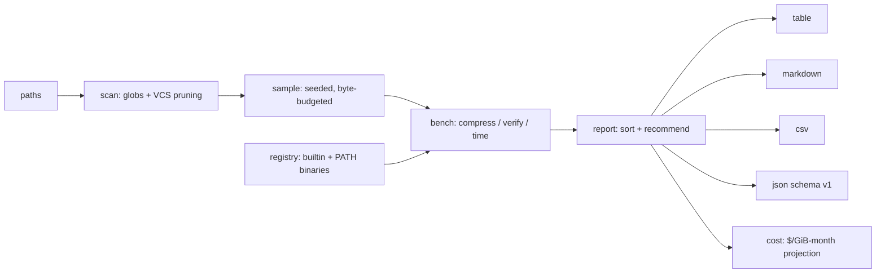

# packbench

[English](README.md) | [中文](README.zh.md) | [日本語](README.ja.md)

[](LICENSE) [](go.mod) [](CHANGELOG.md)  [](CONTRIBUTING.md)

**packbench：an open-source, zero-dependency compression benchmark that measures every codec and level on your actual data — ratio, speed, and storage-cost projections in one deterministic report, instead of folklore about zstd -3.**


```bash
git clone https://github.com/JaydenCJ/packbench && cd packbench
go build -o packbench ./cmd/packbench    # single static binary, stdlib only
```

> Pre-release: v0.1.0 is not tagged on a package registry yet; build from source as above (any Go ≥1.22).

## Why packbench?

Most teams pick their compression settings by folklore — "zstd -3 is the sweet spot", "gzip -9 isn't worth it" — folklore that was measured, if it was ever measured, on the Silesia corpus or a Calgary tarball from another decade. But compression ratios are a property of *your* data: JSON event streams, service logs, Parquet files, and pre-compressed media behave nothing alike, and the codec that wins on a benchmark corpus routinely loses on your bucket. The established tools don't close this gap: lzbench and TurboBench compare codec *library builds* against files you hand-feed them one at a time, and squash-benchmark reports numbers for its own web corpus. packbench points at your directory tree, draws a seeded byte-budgeted sample so multi-TiB trees finish in seconds, runs every codec your machine actually has — Go's built-in DEFLATE family plus the real zstd/xz/bzip2/lz4/brotli binaries you would deploy, pinned to one thread for fair timing — round-trip verifies every result, and prints one report with the number your finance team cares about: dollars per month at your storage price, extrapolated from the sample to the full corpus.

| | packbench | lzbench | zstd -b | squash-benchmark |
|---|---|---|---|---|
| Runs on your directory tree (filters, seeded sampling) | ✅ | ⚠️ files fed one by one | ⚠️ files fed one by one | ❌ fixed web corpus |
| Storage-cost projection ($/GiB-month, monthly/yearly) | ✅ | ❌ | ❌ | ❌ |
| Measures the binaries you deploy (PATH-detected) | ✅ | ❌ bundled lib builds | ⚠️ zstd only | ❌ bundled lib builds |
| Round-trip verification of every result | ✅ default | ⚠️ opt-in | ✅ | ❌ |
| Deterministic, committable report (JSON/CSV/MD) | ✅ `--no-timing` | ❌ text only | ❌ text only | ⚠️ browser UI |
| Recommendation engine (best ratio / fastest / balanced) | ✅ | ❌ | ❌ | ❌ |
| Runtime dependencies | 0 (one static binary) | C build, bundled codec sources | libzstd | browser + hosted data |

<sub>Checked 2026-07-13: packbench imports the Go standard library only; external codecs are optional binaries discovered on PATH at run time, never linked or bundled.</sub>

## Features

- **Your data, not a synthetic corpus** — point it at any mix of files and directories; include/exclude globs, a min-size floor, and automatic VCS-directory pruning keep `.git` packfiles from polluting the numbers.
- **Seeded sampling with a byte budget** — `--max-bytes 64MiB` (the default) benchmarks a fair random sample of a multi-TiB tree in seconds; the same `--seed` draws the same sample forever, and the report says exactly what was sampled.
- **All the codecs you actually have** — store/gzip/zlib/flate/lzw compiled in, zstd/xz/bzip2/lz4/brotli through their own battle-tested binaries when on PATH, each pinned to one thread so MB/s compares one core against one core; spec levels precisely (`--codecs gzip:1-9,zstd:3,zstd:19`).
- **Cost projection your CFO can read** — `--price 0.023` (S3 Standard) turns ratios into monthly dollars and savings, extrapolated from the sample onto the full scanned corpus in honest GiB-month units.
- **Trust, but verify** — every result is decompressed and byte-compared by default; a lying or broken codec is flagged in the report and the exit code, and never aborts the other rows.
- **Deterministic reports you can commit** — with `--no-timing`, identical input and seed produce byte-identical output in all four formats (aligned table, GitHub Markdown, CSV, `schema_version: 1` JSON); diff them in CI when your data drifts.
- **Zero dependencies, fully offline** — Go standard library only, one static binary, no network calls, no telemetry.

## Quickstart

```bash
packbench run ./data
```

Real captured output (a 3.7 MiB mixed corpus: service logs, CSV order exports, and one incompressible binary):

```text
packbench 0.1.0 — 3 files scanned (3.7 MiB); sampled 3 files (3.7 MiB), per-file mode, seed 1

CODEC         SIZE   RATIO  SAVED  COMP MB/s  DEC MB/s
xz:6       1.1 MiB  0.3014  69.9%        0.6      39.6
brotli:11  1.1 MiB  0.3088  69.1%        0.2      43.4
zstd:19    1.2 MiB  0.3202  68.0%        0.4      36.0
brotli:6   1.2 MiB  0.3227  67.7%       10.0     111.3
bzip2:9    1.2 MiB  0.3289  67.1%        3.5       3.6
zstd:3     1.3 MiB  0.3594  64.1%       85.2     136.7
gzip:9     1.4 MiB  0.3687  63.1%        5.0      84.8
gzip:6     1.4 MiB  0.3895  61.0%       11.4      88.4
gzip:1     1.5 MiB  0.4111  58.9%       79.6      57.5
lz4:9      1.5 MiB  0.4145  58.6%       10.0      35.8
lz4:1      1.8 MiB  0.4723  52.8%       44.5      41.4
lzw        2.0 MiB  0.5384  46.2%       30.2      31.4
store      3.7 MiB  1.0000   0.0%      406.9     194.9

best ratio    xz:6
fastest       zstd:3
balanced      zstd:3   (most bytes shed per CPU-second)
```

Add a storage price and packbench prices the whole corpus. Real output against 4.1 GiB of production-shaped logs and NDJSON (the default 64 MiB budget sampled it in seconds; multiply by 1000 for a 4 TiB bucket):

```text
packbench 0.1.0 — 3 files scanned (4.1 GiB); sampled 1 file (64.0 MiB), per-file mode, seed 1
cost: $0.0230 per GiB-month, projected onto the full 4.1 GiB corpus (raw: $0.09/mo)

CODEC          SIZE   RATIO  SAVED  COMP MB/s  DEC MB/s  USD/MO  SAVE/MO
xz:6        2.1 MiB  0.0325  96.7%        0.4      45.8   $0.00    $0.09
zstd:19     3.2 MiB  0.0498  95.0%        0.2     176.7   $0.00    $0.09
bzip2:9     4.2 MiB  0.0654  93.5%        2.6       4.4   $0.01    $0.09
gzip:9      6.6 MiB  0.1033  89.7%        5.1      76.6   $0.01    $0.08
zstd:3      8.1 MiB  0.1259  87.4%      233.7     341.1   $0.01    $0.08
lz4:1      13.4 MiB  0.2094  79.1%      292.8     460.1   $0.02    $0.07
store      64.0 MiB  1.0000   0.0%      391.6     338.5   $0.09    $0.00

best ratio    xz:6
fastest       lz4:1
balanced      lz4:1   (most bytes shed per CPU-second)
```

(Six of thirteen rows trimmed here for brevity — the folklore check is right there: on this corpus zstd:3 gives up 9 points of savings to xz:6 but compresses ~580× faster, and `balanced` goes to lz4:1, the row that sheds the most bytes per CPU-second.)

## CLI reference

`packbench [run|codecs|version] [flags]` — exit codes: 0 ok, 1 a codec failed or flunked verification, 2 usage error, 3 runtime error. `packbench codecs` prints the full catalogue with each family's level range, default, and resolved binary path.

| Flag | Default | Effect |
|---|---|---|
| `--codecs` | `auto` | `auto` (everything detected, curated levels), `all`, or `gzip:1-9,zstd:3,lzw` |
| `--max-bytes` | `64MiB` | sample byte budget and RAM ceiling; `0` = whole corpus |
| `--max-files` / `--min-size` | `0` / `0` | sample file cap / skip files smaller than this |
| `--include` / `--exclude` | — | glob filters (repeatable); exclude wins |
| `--seed` | `1` | sampling seed; same seed, same sample, same report |
| `--concat` | off | benchmark one solid archive (tar-then-compress) instead of per-file |
| `--price` | — | USD per GiB-month; adds cost columns (S3 Standard is `0.023`) |
| `--format` / `--sort` | `table` / `ratio` | `table` `md` `csv` `json` / `ratio` `saved` `comp` `dec` `cost` `name` |
| `--no-verify` / `--no-timing` | off | skip round-trip check / drop MB/s for byte-identical output |
| `--no-external` / `--out` | off / stdout | built-in codecs only / write the report to a file |

Full JSON schema and exit-code contract: [docs/report-format.md](docs/report-format.md).

## Verification

This repository ships no CI; every claim above is verified by local runs:

```bash
go test ./...            # 91 deterministic tests, offline, < 5 s
bash scripts/smoke.sh    # end-to-end CLI check, prints SMOKE OK
```

The suite injects the clock, PATH lookups, and fake shell-script codecs, so it passes identically on a machine with no external codecs installed.

## Architecture



## Roadmap

- [x] v0.1.0 — ten codec families (five builtin, five via PATH binaries), seeded byte-budgeted sampling, round-trip verification, four report formats, cost projection, recommendation engine, 91 tests + smoke script
- [ ] `--baseline old.json` — diff two reports and alert when data drift changes the winner
- [ ] Parallel benchmarking with per-worker timing isolation (`--jobs`)
- [ ] zstd dictionary training for small-file corpora (`--train-dict`)
- [ ] Decompression-weighted balanced pick for read-heavy workloads (`--read-ratio`)
- [ ] Content-type breakdown: per-extension sub-tables in one run

See the [open issues](https://github.com/JaydenCJ/packbench/issues) for the full list.

## Contributing

Issues, discussions and pull requests are welcome — see [CONTRIBUTING.md](CONTRIBUTING.md) for the local workflow (format, vet, tests, `SMOKE OK`). Good entry points are labelled [good first issue](https://github.com/JaydenCJ/packbench/issues?q=is%3Aissue+is%3Aopen+label%3A%22good+first+issue%22), and design questions live in [Discussions](https://github.com/JaydenCJ/packbench/discussions).

## License

[MIT](LICENSE)
