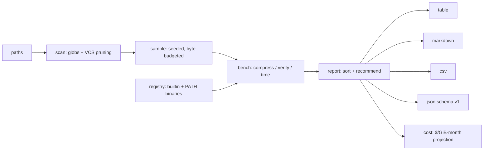

# packbench

[English](README.md) | [中文](README.zh.md) | [日本語](README.ja.md)

[](LICENSE) [](go.mod) [](CHANGELOG.md)  [](CONTRIBUTING.md)

**packbench：开源、零依赖的压缩基准工具，在你的真实数据上测量每个编解码器和每个级别——压缩比、速度和存储成本预估汇成一份确定性报告，不再靠 "zstd -3" 的江湖传说。**


```bash
git clone https://github.com/JaydenCJ/packbench && cd packbench
go build -o packbench ./cmd/packbench    # single static binary, stdlib only
```

> 预发布：v0.1.0 尚未发布到任何包仓库；请按上面方式从源码构建（Go ≥1.22 均可）。

## 为什么选 packbench？

大多数团队靠江湖传说选压缩参数——"zstd -3 是甜点位"、"gzip -9 不划算"——这些传说即便真被测过，也是在 Silesia 语料或上个年代的 Calgary tarball 上测的。但压缩比是*你的*数据的属性：JSON 事件流、服务日志、Parquet 文件和已压缩媒体的表现天差地别，在基准语料上获胜的编解码器在你的存储桶上经常落败。现有工具没有弥合这个鸿沟：lzbench 和 TurboBench 比较的是编解码器的*库构建*，要你逐个手动喂文件，squash-benchmark 报告的则是它自己的网页语料的数字。packbench 直接指向你的目录树，用带字节预算的种子采样让多 TiB 的树几秒内完成，运行你机器上真实存在的每个编解码器——Go 内置的 DEFLATE 家族，加上你实际部署的 zstd/xz/bzip2/lz4/brotli 二进制，全部钉在单线程上保证计时公平——对每个结果做往返校验，并输出一份带着财务团队真正关心的数字的报告：按你的存储单价折算的每月美元，从样本外推到整个语料。

| | packbench | lzbench | zstd -b | squash-benchmark |
|---|---|---|---|---|
| 直接跑你的目录树（过滤器、种子采样） | ✅ | ⚠️ 逐个喂文件 | ⚠️ 逐个喂文件 | ❌ 固定网页语料 |
| 存储成本预估（$/GiB·月，月度/年度） | ✅ | ❌ | ❌ | ❌ |
| 测量你实际部署的二进制（PATH 自动探测） | ✅ | ❌ 捆绑库构建 | ⚠️ 仅 zstd | ❌ 捆绑库构建 |
| 每个结果的往返校验 | ✅ 默认开启 | ⚠️ 需手动开启 | ✅ | ❌ |
| 确定性、可提交的报告（JSON/CSV/MD） | ✅ `--no-timing` | ❌ 仅文本 | ❌ 仅文本 | ⚠️ 仅浏览器 UI |
| 推荐引擎（最佳压缩比 / 最快 / 均衡） | ✅ | ❌ | ❌ | ❌ |
| 运行时依赖 | 0（单一静态二进制） | C 构建，捆绑编解码器源码 | libzstd | 浏览器 + 托管数据 |

<sub>核对于 2026-07-13：packbench 仅导入 Go 标准库；外部编解码器是运行时在 PATH 上发现的可选二进制，从不链接或捆绑。</sub>

## 特性

- **你的数据，而非合成语料** — 指向任意文件和目录的组合；include/exclude 通配符、最小体积下限和自动的 VCS 目录剪枝，防止 `.git` packfile 污染数字。
- **带字节预算的种子采样** — `--max-bytes 64MiB`（默认值）几秒内对多 TiB 的树基准测试一份公平的随机样本；相同的 `--seed` 永远抽出相同的样本，报告如实说明采了什么。
- **你真正拥有的全部编解码器** — store/gzip/zlib/flate/lzw 编译内置，zstd/xz/bzip2/lz4/brotli 在 PATH 上时通过它们各自久经沙场的二进制驱动，全部钉在单线程上让 MB/s 是一个核对一个核；级别可精确指定（`--codecs gzip:1-9,zstd:3,zstd:19`）。
- **CFO 能看懂的成本预估** — `--price 0.023`（S3 标准层）把压缩比换算成每月美元和节省额，从样本外推到整个扫描语料，用诚实的 GiB·月单位。
- **信任，但要校验** — 每个结果默认都会解压并逐字节比对；说谎或损坏的编解码器会在报告和退出码里被标记，且永不中断其它行。
- **可提交进仓库的确定性报告** — 加 `--no-timing` 后，相同输入和种子在全部四种格式（对齐表格、GitHub Markdown、CSV、`schema_version: 1` JSON）下产生逐字节一致的输出；数据漂移时在 CI 里 diff 它们。
- **零依赖，完全离线** — 仅 Go 标准库，单一静态二进制，无网络调用，无遥测。

## 快速上手

```bash
packbench run ./data
```

真实捕获的输出（3.7 MiB 混合语料：服务日志、CSV 订单导出和一个不可压缩的二进制文件）：

```text
packbench 0.1.0 — 3 files scanned (3.7 MiB); sampled 3 files (3.7 MiB), per-file mode, seed 1

CODEC         SIZE   RATIO  SAVED  COMP MB/s  DEC MB/s
xz:6       1.1 MiB  0.3014  69.9%        0.6      39.6
brotli:11  1.1 MiB  0.3088  69.1%        0.2      43.4
zstd:19    1.2 MiB  0.3202  68.0%        0.4      36.0
brotli:6   1.2 MiB  0.3227  67.7%       10.0     111.3
bzip2:9    1.2 MiB  0.3289  67.1%        3.5       3.6
zstd:3     1.3 MiB  0.3594  64.1%       85.2     136.7
gzip:9     1.4 MiB  0.3687  63.1%        5.0      84.8
gzip:6     1.4 MiB  0.3895  61.0%       11.4      88.4
gzip:1     1.5 MiB  0.4111  58.9%       79.6      57.5
lz4:9      1.5 MiB  0.4145  58.6%       10.0      35.8
lz4:1      1.8 MiB  0.4723  52.8%       44.5      41.4
lzw        2.0 MiB  0.5384  46.2%       30.2      31.4
store      3.7 MiB  1.0000   0.0%      406.9     194.9

best ratio    xz:6
fastest       zstd:3
balanced      zstd:3   (most bytes shed per CPU-second)
```

加上存储单价，packbench 就给整个语料定价。以下是对 4.1 GiB 生产形态的日志和 NDJSON 的真实输出（默认 64 MiB 预算几秒内完成采样；4 TiB 的桶请乘以 1000）：

```text
packbench 0.1.0 — 3 files scanned (4.1 GiB); sampled 1 file (64.0 MiB), per-file mode, seed 1
cost: $0.0230 per GiB-month, projected onto the full 4.1 GiB corpus (raw: $0.09/mo)

CODEC          SIZE   RATIO  SAVED  COMP MB/s  DEC MB/s  USD/MO  SAVE/MO
xz:6        2.1 MiB  0.0325  96.7%        0.4      45.8   $0.00    $0.09
zstd:19     3.2 MiB  0.0498  95.0%        0.2     176.7   $0.00    $0.09
bzip2:9     4.2 MiB  0.0654  93.5%        2.6       4.4   $0.01    $0.09
gzip:9      6.6 MiB  0.1033  89.7%        5.1      76.6   $0.01    $0.08
zstd:3      8.1 MiB  0.1259  87.4%      233.7     341.1   $0.01    $0.08
lz4:1      13.4 MiB  0.2094  79.1%      292.8     460.1   $0.02    $0.07
store      64.0 MiB  1.0000   0.0%      391.6     338.5   $0.09    $0.00

best ratio    xz:6
fastest       lz4:1
balanced      lz4:1   (most bytes shed per CPU-second)
```

（此处为篇幅略去十三行中的六行——江湖传说的检验就在眼前：在这份语料上 zstd:3 比 xz:6 少省 9 个点，但压缩快约 580 倍；`balanced` 归 lz4:1——每 CPU 秒甩掉最多字节的那一行。）

## CLI 参考

`packbench [run|codecs|version] [flags]` — 退出码：0 正常，1 有编解码器失败或未通过校验，2 用法错误，3 运行时错误。`packbench codecs` 打印完整目录，含每个家族的级别范围、默认值和解析出的二进制路径。

| 标志 | 默认值 | 效果 |
|---|---|---|
| `--codecs` | `auto` | `auto`（探测到的全部，精选级别）、`all`，或 `gzip:1-9,zstd:3,lzw` |
| `--max-bytes` | `64MiB` | 采样字节预算兼内存上限；`0` = 整个语料 |
| `--max-files` / `--min-size` | `0` / `0` | 采样文件数上限 / 跳过小于此值的文件 |
| `--include` / `--exclude` | — | 通配符过滤（可重复）；exclude 优先 |
| `--seed` | `1` | 采样种子；同种子、同样本、同报告 |
| `--concat` | 关 | 按单个实体归档（先 tar 再压缩）而非逐文件基准 |
| `--price` | — | 美元每 GiB·月；添加成本列（S3 标准层为 `0.023`） |
| `--format` / `--sort` | `table` / `ratio` | `table` `md` `csv` `json` / `ratio` `saved` `comp` `dec` `cost` `name` |
| `--no-verify` / `--no-timing` | 关 | 跳过往返校验 / 去掉 MB/s 以获得逐字节一致的输出 |
| `--no-external` / `--out` | 关 / stdout | 仅内置编解码器 / 把报告写入文件 |

完整 JSON 模式与退出码契约：[docs/report-format.md](docs/report-format.md)。

## 验证

本仓库不携带 CI；上面每一条主张都由本地运行验证：

```bash
go test ./...            # 91 deterministic tests, offline, < 5 s
bash scripts/smoke.sh    # end-to-end CLI check, prints SMOKE OK
```

测试套件注入时钟、PATH 查找和假的 shell 脚本编解码器，因此在一台没装任何外部编解码器的机器上也照样通过。

## 架构



## 路线图

- [x] v0.1.0 — 十个编解码器家族（五个内置、五个经 PATH 二进制）、带字节预算的种子采样、往返校验、四种报告格式、成本预估、推荐引擎、91 个测试 + 冒烟脚本
- [ ] `--baseline old.json` — 对比两份报告，数据漂移改变赢家时报警
- [ ] 并行基准测试，逐 worker 计时隔离（`--jobs`）
- [ ] 面向小文件语料的 zstd 字典训练（`--train-dict`）
- [ ] 读密集负载的解压加权均衡推荐（`--read-ratio`）
- [ ] 内容类型细分：一次运行输出按扩展名的子表

完整列表见 [open issues](https://github.com/JaydenCJ/packbench/issues)。

## 参与贡献

欢迎 issue、讨论和 PR——本地工作流（格式化、vet、测试、`SMOKE OK`）见 [CONTRIBUTING.md](CONTRIBUTING.md)。入门任务标注为 [good first issue](https://github.com/JaydenCJ/packbench/issues?q=is%3Aissue+is%3Aopen+label%3A%22good+first+issue%22)，设计讨论在 [Discussions](https://github.com/JaydenCJ/packbench/discussions)。

## 许可证

[MIT](LICENSE)
